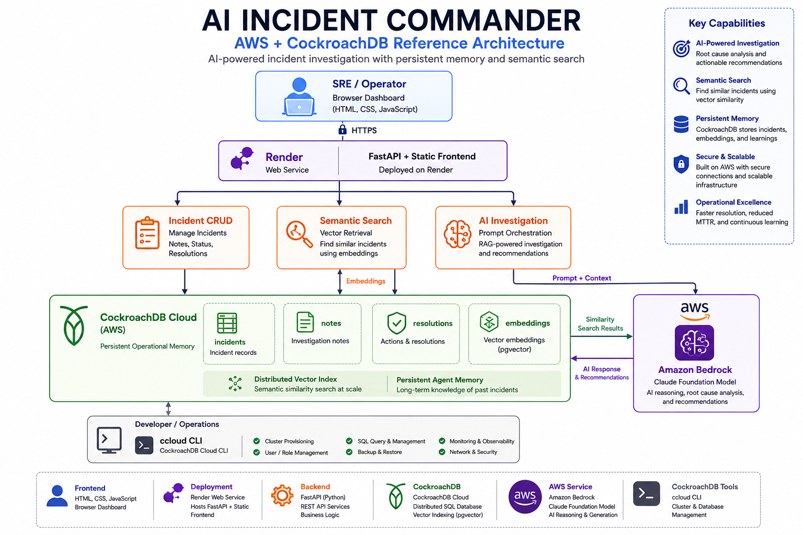

# 🚨 Incident Commander AI

AI-powered incident response platform that combines semantic search, vector memory, and Amazon Bedrock to investigate production incidents using historical knowledge stored in CockroachDB.

> Built for the CockroachDB x AWS Agentic AI Hackathon.

---

## Architecture

<p align="center">
  
  <br>
  <em>System Architecture</em>
</p>

---

## Features

- 🚨 Create and manage production incidents
- 🧠 AI-powered incident investigation
- 🔍 Semantic search across historical incidents
- 📚 Persistent vector memory using CockroachDB
- 🤖 Root cause analysis with Amazon Bedrock (Claude)
- 📈 Recommended immediate and long-term remediation
- 🌐 FastAPI REST API
- 💻 Responsive web dashboard

---

## Demo

**Live Application**

https://incident-commander-339p.onrender.com


---

# Tech Stack

### Frontend

- HTML5
- CSS3
- JavaScript

### Backend

- Python
- FastAPI
- Uvicorn
- Psycopg

### Database

- CockroachDB Cloud
- Distributed Vector Indexing
- pgvector

### AI

- Amazon Bedrock
- Anthropic Claude

### Infrastructure

- AWS
- Render
- GitHub

### Developer Tools

- CockroachDB ccloud CLI
- CockroachDB Cloud Console

---

# Architecture

The application follows a Retrieval-Augmented Generation (RAG) workflow.

1. A user creates an incident through the web interface.
2. FastAPI stores the incident in CockroachDB.
3. Amazon Bedrock generates an embedding for the incident summary.
4. The embedding is stored inside CockroachDB using Distributed Vector Indexing.
5. When an investigation is requested:
   - the current incident is embedded,
   - CockroachDB performs semantic vector search,
   - the most relevant historical incidents are retrieved,
   - Claude receives those incidents as context,
   - Claude generates root-cause analysis and remediation guidance.
6. Results are displayed in the dashboard.

---

# CockroachDB Features Used

This project uses **two required CockroachDB technologies**.

## Distributed Vector Indexing

- Stores incident embeddings
- Performs semantic similarity search
- Provides long-term memory for the AI agent

## ccloud CLI

Used for:

- cluster management
- SQL execution
- verifying stored incidents
- demonstrating persistent AI memory

---

# AWS Services Used

## Amazon Bedrock

Claude is used to:

- generate embeddings
- perform Retrieval-Augmented Generation
- investigate incidents
- recommend remediation actions

---

# API Endpoints

| Method | Endpoint | Description |
|---------|----------|-------------|
| GET | /incidents | List incidents |
| POST | /incidents | Create incident |
| POST | /search | Semantic search |
| POST | /commander/investigate | AI investigation |
| GET | /ai/{id} | AI summary |

---

# Running Locally

Clone the repository.

```bash
git clone https://github.com/YOUR_USERNAME/incident-commander.git

cd incident-commander
```

Install dependencies.

```bash
pip install -r requirements.txt
```

Configure environment variables.

```text
DATABASE_URL=...
AWS_ACCESS_KEY_ID=...
AWS_SECRET_ACCESS_KEY=...
AWS_REGION=...
```

Run the application.

```bash
uvicorn backend.main:app --reload
```

Open

```
http://127.0.0.1:8000
```

---

# Project Structure

```
incident-commander/

backend/
    api/
    services/
    static/
    main.py
    crud.py
    database.py

docs/
    architecture.png

README.md
requirements.txt
LICENSE
```

---

# Future Improvements

- Multi-agent incident orchestration
- Automatic incident creation from CloudWatch alerts
- Slack and Microsoft Teams integration
- Streaming AI responses
- Authentication and role-based access control
- Incident timeline visualization
- Knowledge base expansion with S3 documents

---

# License

MIT License